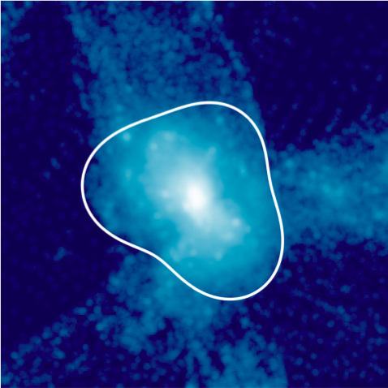

# Shellfish

Shellfish (**SHELL** **F**inding **I**n **S**pheroidal **H**alos) is a toolchain for finding
the splashback shells of individual halos within cosmological simulations. Shellfish
is written in the programming langue [Go](https://golang.org/).

Shellfish is currently in version 0.2.0. The current maintainer is
[Phil Mansfield](http://astro.uchicago.edu/people/philip-mansfield.php) at the
University of Chicago.

### Getting help

If you run into problems that you cannot solve yourself, the best thing to do is to
[make a github account](github.com/join) (it's quick!) and submit an "Issue" about
your question or bug [here](https://github.com/phil-mansfield/shellfish/issues).
(Don't worry about the tabs on the right hand part of the submit form: I'll
take care of this when I see it). The second best option is to email me:
you should do this if you do not want your question or bug report to be public.

### Installation

There are two steps to installing Shellfish. The first is installing a Go compiler
(which is relatively painless compared to installing most other compilers), and the
second is compiling Shellfish and its dependencies (which is completely painless).

If you are working on a computer that you own, download the latest version of the Go
compiler from [here](https://golang.org/doc/install) and follow the instructions.
If you are working on a cluster, you can also ask the cluster staff to install the
compiler for you. Regardless of how you install it, you will need to make a few changes
to your `.profile` file, so make sure to read the section titled *Test your installation*
and run the hello world program there.

Once you've done this, its time to download and install Shellfish's dependencies. Run
the shell script `download.sh` (no need for root access). To test whether installation
was successful, type `$ shellfish hello`.

### How to Use Shellfish

Shellfish is a set of unix-like command line tools which produce human-readable catalogs.
You can write a configuration file describing the layout of your particle snapshots and
halo catalog, specify the halos you want to measure the splashback shell for, and then
Shellfish will take care of the rest.

You can find a tutorial on using Shellfish [here](https://github.com/phil-mansfield/shellfish/blob/master/doc/tutorial.md).
It typically takes about 10 minutes to read through.

### List of Supported File Formats

Currently supported particle catalog types:

* gotetra
* LGadget-2 (works on most other versions of Gadget, too)
* ARTIO (experimental)

Currently supported halo catalog types:

* All text column-based catalogs

Currently supported merger tree types:

* consistent-trees

If you would like to use a particle catalog type which is not supported here,
plase submit an Issue requesting support. Shellfish is written in a way that
makes it easy to interact with unsupported halo catalogs and meger trees (as
covered in [the tutorial](https://github.com/phil-mansfield/shellfish/blob/master/doc/tutorial.md)),
but feel free to submit an issue requesting support as well.

### Warning

Current accuracy tests indicate that Shellfish overestimates shell sizes for
small, slowly accreting halos (Gamma < ~1-1.5) by about 10%. We recommend against
using it for these halos.

### Next Planned Release

The next planned release is version 1.0.0, which will contain a finalized API and
complete documentation.
